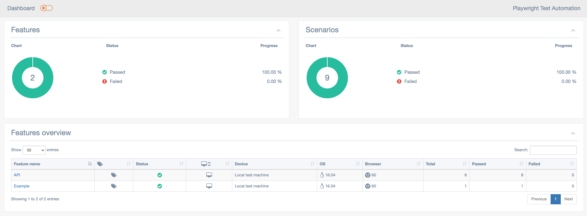

# Cucumber (BDD) + Playwright + TypeScript

This repository contains a Playwright and Cucumber project for automated testing using the Playwright testing framework with TypeScript. The project is designed to demonstrate various features of Playwright (UI and API) and includes integration with Cucumber for behavior-driven development.

## Table of Contents

- [Prerequisites](#prerequisites)
- [Installation](#installation)
- [Running Tests](#running-tests)
- [Test Report](#test-report)
- [Project Structure](#project-structure)
- [TODO](#todo-list)

## Prerequisites

Before you begin, ensure you have the following installed on your machine:

- Node.js: [Download and install Node.js](https://nodejs.org/)

## Installation

1. Clone the repository to your local machine:

   ```bash
   git clone https://github.com/muhammetyilmaz00/Playwright_Cucumber_Typescript.git

2. Navigate to the project directory:

   ```bash
   cd Playwright_Cucumber_Typescript

3. Install project dependencies using npm:

   ```bash
   npm install

## Running Tests
To run the Playwright tests, use the following command:

```bash
npm run test
```

This will execute the Playwright tests in headless mode using the Chromium browser.

## Test Report
After running the tests, you can find the HTML test report in the in the root of your project:

```bash
test-results/
    or
index.html
```
Sample report



## Project Structure

The project follows a standard Playwright project structure:


* src/test/featureFiles: Includes feature files for Cucumber BDD.
* src/test/steps: Includes step definitions of the feature files
* support/config.ts: Includes configuration settings of browser
* support/report.ts: Includes configuration settings of multiple-cucumber-html-reporter
* support/apiContext.ts: Includes abstract implementation of the API context
* support/contextStore.ts: Includes implementation of the context store 
* node_modules: Dependencies installed via npm.
* package.json: Configuration file with project metadata and dependencies.
* tsconfig.json: TypeScript configuration file.

## TODO List

- Setting the environment variables (test, dev, staging, prod) for the tests to the default values provided by the command line
